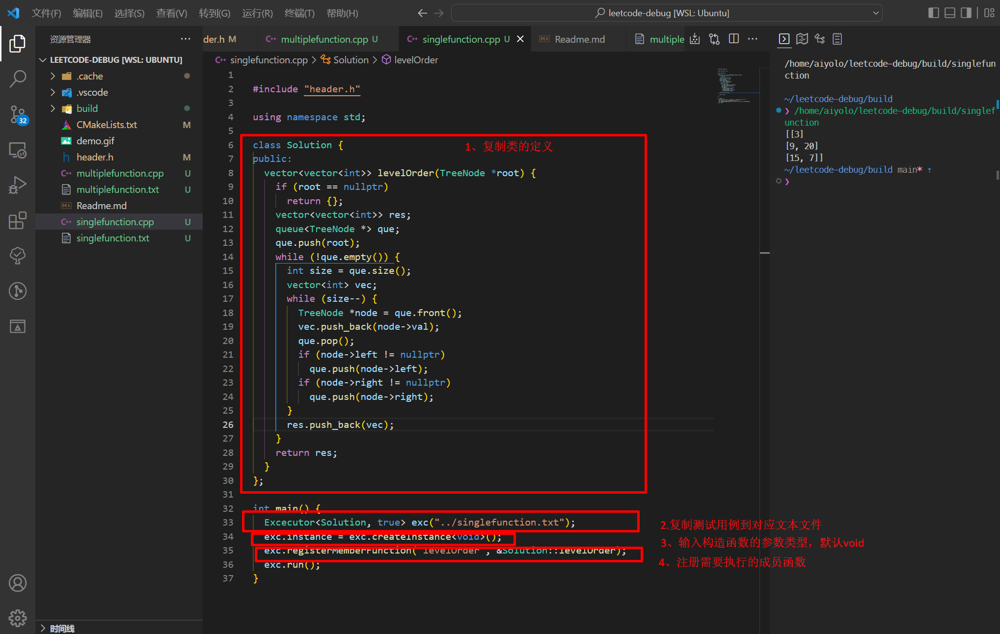

# 功能

只需要复制 leetcode 中的测试用例到本地 testcases.txt 文件，复制 Solution() 类到本地 main.cpp 文件，main.cpp 文件能够逐行解析输入变量，从而实现在本地调试的功能。

[项目路径](https://github.com/aiyolo/leetcode-debug)

# 演示
简单三步

# 使用方法

1. 复制 Solution 类到 main.cpp
2. 复制测试用例数据到 testcase.txt
3. 复制成员函数名
4. 运行

# 注意事项

1. 对于有多个成员函数需要运行的，请使用`multiplefunction.cpp`

2. 所有成员函数最终的调用点在`MemberFunciton::exec`，请在此处自定义输出结果

3. 默认使用 `cmake` 编译，c++ 标准要求 c++17 及以上

# 原理
- 将类中所有成员函数名和成员函数地址对，注册到一个unordered_map，通过检索成员函数名即可找到成员函数地址
- 为了存储不同的成员函数地址，需要将它们包装`MemberFunction`类，且所有的MemberFunction类都需要继承自同一个`MemberFunctionBase`基类
- 结合元编程中`type_traits`的相关工具，将测试用例中的字符串解析成对应的函数的参数类型
- 运行每一个测试用例中的函数

目前支持处理如下的数据类型，这些类型应对大部分测试用例都是可以的。

- `int`
- `string`
- `vector<int>`
- `vector<char>`
- `vector<vector<int>>`
- `vector<vector<char>>`
- `vector<string>`
- `ListNode*`
- `TreeNode*`
